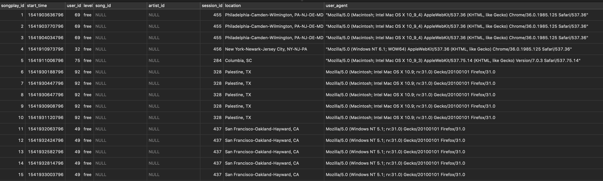
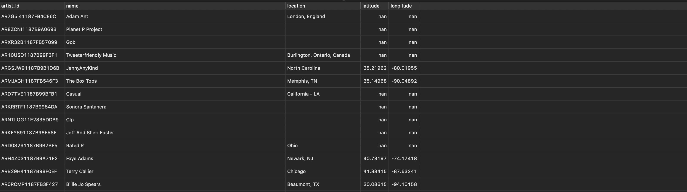
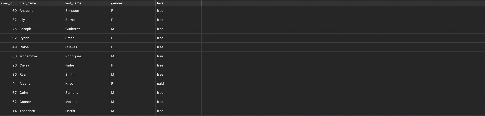
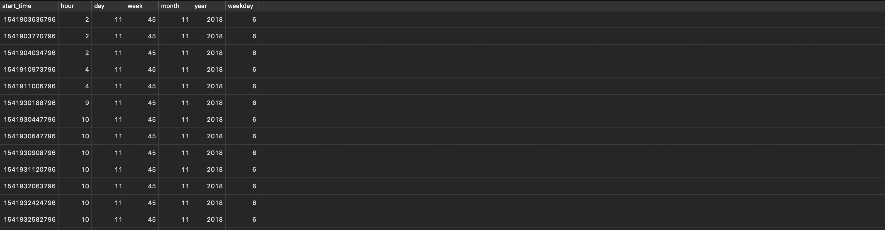
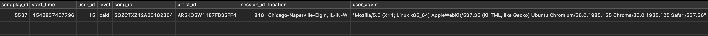

# Project: Sparkify Data ETL 

This project was completed on 5th June 2021.

## Introduction

A startup called Sparkify wants to analyze the data they've been collecting on songs and user activity on their new music streaming app. 

All their data is stored in JSON files and is difficult to analyze. The requirements are to process all the data stored inside the JSON
files, transform it, and then store it inside a Postgres database so that it can be easily queried by Sparkify's analytics team.

This project hence contains:
1. Scripts to setup the database structure with the necessary tables for sparkifydb.
2. ETL pipeline to process the json data.
3. Tests to ensure data has been inserted into sparkifydb correctly.

## Quick Start Guide

1. Ensure Python 3.6+ is installed
2. Clone the repo: ```git clone https://github.com/aivoric/Data-Engineering-ND-Modelling-Postgres-Project-1.git```
3. Enter the downloaded folder and create a virtual environment: ```python3 -m venv env```
4. Install dependencies: ```pip install -r requirements.txt```

The next steps assume you have Postgres up and running with the following defaults:
```"host=127.0.0.1 dbname=studentdb user=postgres password=postgres"```

5. Run create_tables.py to setup the database: ```python create_tables.py```
6. Run etl.py which will process the json data inside the /data folder: ```python etl.py```
7. Run test.py which will query the inserted data and show sample data in the terminal: ```python test.py```

## Setting Up Postgres Locally

Postgres can be tricky tp setup locally. Here is a useful guide for Mac users (sorry Windows users!):
https://www.codementor.io/@engineerapart/getting-started-with-postgresql-on-mac-osx-are8jcopb


## Notes on Files

```sql_queries.py``` contains all the SQL statements for creating, inserting and selecting data for 5 tables:
* songs
* artists
* users
* time
* songplays

```create_tables.py``` contains the logic for connecting to Postgres, and re-creating the entire sparkify database structure. Only run this file when you want to drop the entire database and re-create it from scratch. It uses SQL scripts contained in ```sql_queries.py```

```etl.py``` contains the logic for the data pipeline. It processes files located in the ```/data``` folder and then uses SQL scripts contained in ```sql_queries.py``` to insert data into sparkifydb.

```test.py``` uses SQL scripts contained in ```sql_queries.py``` to check that data has been inserted into the database.

```etl.ipynb``` can be ignored. It was used for the purpose of developing the etl pipeline.

## Database Design

The database was designed with a star schema optimized for queries on song play analysis. 

The design includes a single fact table and 4 dimension tables.

3 of the dimension tables (users, songs, artists) are based around logical entities within Sparkify. The time dimension table was created for the purpose of being able to quickly join the table with songplays and query based on different time units.

Here is a summary of all the tables:

#### **Fact Table**

1. **songplays** - records in log data associated with song plays i.e. records with page `NextSong`
    - *songplay_id, start_time, user_id, level, **song_id**, **artist_id**, session_id, location, user_agent*

#### **Dimension Tables**

1. **users** - users in the app
    - *user_id, first_name, last_name, gender, level*
2. **songs** - songs in music database
    - *song_id, title, artist_id, year, duration*
3. **artists** - artists in music database
    - *artist_id, name, location, latitude, longitude*
4. **time** - timestamps of records in **songplays** broken down into specific units
    - *start_time, hour, day, week, month, year, weekday*

## A Note on Bulk Data Upload

In the latest version ```etl.py``` has been refactored to upload the log data in bulk for:
* time data
* user data
* songplay data

This has significantly increased the upload speed. 

However, there were a few technical challenges:
1. The Postgres COPY statement does not handle duplicate primary keys. The workaround for that is to use a temporary table. A good solution was provided here:
https://stackoverflow.com/questions/13947327/to-ignore-duplicate-keys-during-copy-from-in-postgresql

2. The fastest way to COPY a dataframe in the database is actually by first converting it into a CSV, and then running the COPY statement to read data from the CSV. A good summary of this is provided here: 
https://towardsdatascience.com/upload-your-pandas-dataframe-to-your-database-10x-faster-eb6dc6609ddf

The above two points can be seen in the following SQL pattern which can also be found in ```sql_queries.py```:

```
"CREATE TEMP TABLE temp_table AS SELECT * FROM main_table WITH NO DATA;"
"COPY temp_table FROM 'path/to/csv' DELIMITER ',' CSV;"
"INSERT INTO main_table SELECT * FROM temp_table ON CONFLICT DO NOTHING;"
"DROP TABLE temp_table;"
```


## Example Queries and Expected Results

The following queries were executed using Postico: https://eggerapps.at/postico/

```SELECT * FROM songplays;```



```SELECT * FROM artists;```



```SELECT * FROM songs;```


```SELECT * FROM users;```



```SELECT * FROM time;```



```SELECT * FROM songplays WHERE song_id IS NOT NULL AND artist_id IS NOT NULL;```



